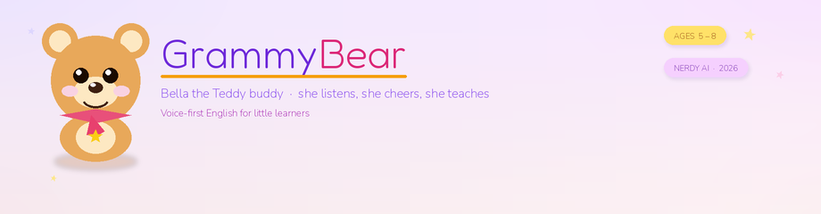
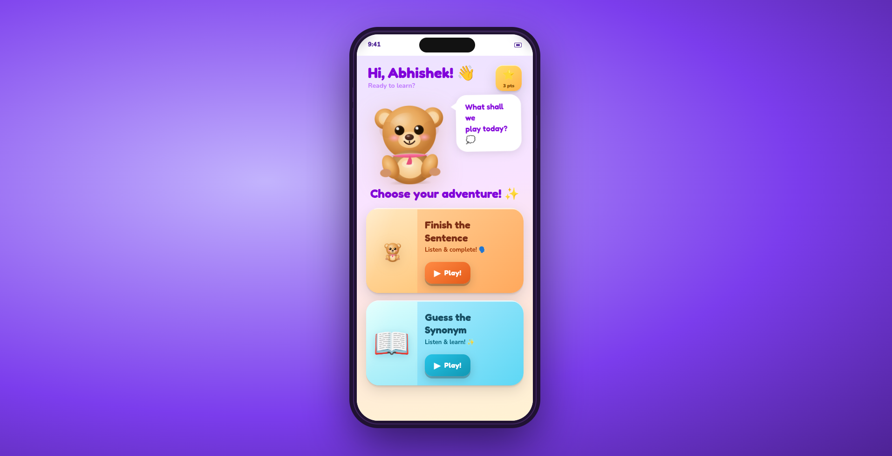
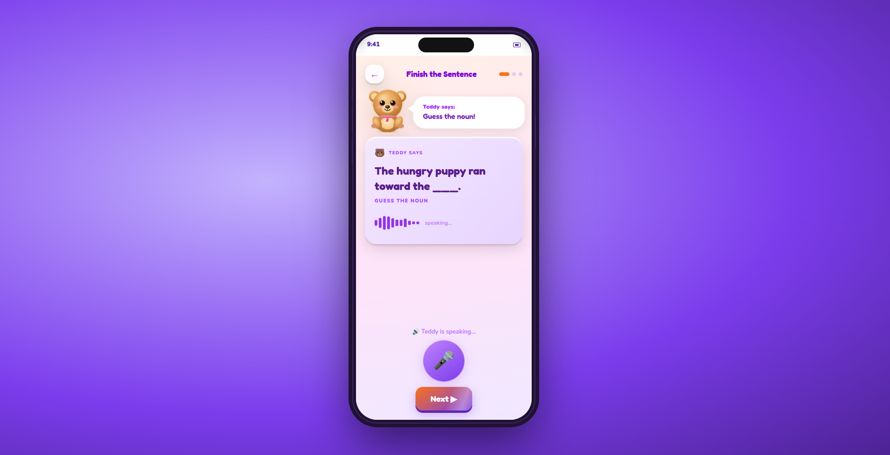
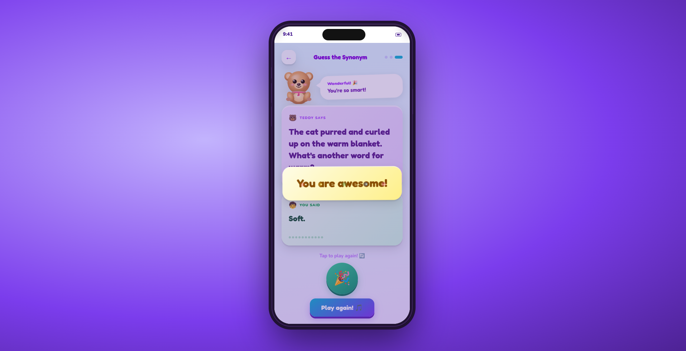

<p align="center">
  
</p>
<p align="center">
  
</p>
<p align="center">
  <strong>Meet Bella.</strong> She is the <strong>GrammyBear</strong> — a voice-first English tutor for ages 5–8.<br/>
  Built for the <a href="https://hackathon.nerdy.com/">Nerdy AI Hackathon Challenge</a>
</p>
---

# GrammyBear

**Bella the Teddy buddy** is a GrammyBear and loves teaching little kids english grammar: she hears the child, decides if the answer works, and talks back in a warm kid voice. No typing. No multiple choice. Two games, a name on the home screen, and a cheer when they get it right.

---

## What it is

Kids this age do not want to tap through flashcards. They want to *say* the word. Bella the GrammyBear is a phone-friendly tutor that:

1. Asks for the child’s **name**, then uses it.
2. Plays **Finish the Sentence** — a missing word (noun, verb, and friends). Close synonyms count; there is no rigid answer key.
3. Plays **Guess the Synonym** — a full sentence, then “what’s another word for ___?”
4. Keeps a **star / high score**, celebrates a correct turn, and moves on by itself.
5. Treats unsafe speech as a **safety** problem, not a wrong grammar score (kind words, no scary or adult topics, get a grown-up when it really matters).

The judge is the on-device language model, not a list of canned answers. “Glad” can count for “happy.” “Table” can count if it still finishes the sentence well.

---

## A look inside

Bella on a phone: home, a live sentence, then a cheer.

<table>
  <tr>
    <td align="center" width="33%">
      
      <br/>
      <em>Home — pick a game</em>
    </td>
    <td align="center" width="33%">
      
      <br/>
      <em>Finish the Sentence — Bella speaking</em>
    </td>
    <td align="center" width="33%">
      
      <br/>
      <em>Guess the Synonym — a correct cheer</em>
    </td>
  </tr>
</table>

---

## How a turn works

```
Child speaks into the phone
        ↓
GrammyBear hears the words  (speech-to-text)
        ↓
Safety check, then “is this a fair answer?”  (language model)
        ↓
GrammyBear talks  (text-to-speech)  and shows the next sentence
```

Only **one** public website is shared. The heavy model stays on the GPU computer and is never exposed to the internet.

```
Phone or laptop  ──HTTPS──►  App (port 8003)
                                   ├─ listens / speaks
                                   └─ asks the local model (port 8000) in private
```

| Piece | Role, in plain words |
| --- | --- |
| Screen | Colorful phone UI (React). Mic, bear, sentence card, star. |
| App | Python server that glues everything together. |
| Ears | Speech-to-text on the **CPU**, so the GPU stays free for thinking. |
| Brain | Local Qwen 14B model (compressed to fit ~12 GB of GPU memory). |
| Voice | Kokoro — a small, fast spoken voice (Bella by default). |

If the model is briefly down, a backup bank of sentences keeps the game moving.

---

## What you need

- A **Linux PC with an NVIDIA GPU** (this project was tuned on an RTX 5070 with 12 GB VRAM). A similar 12 GB card should work with the bundled start script or even a cloud based GPU can work.
- **Conda** environment `sentence_coach` (see `environment.yml`).
- **ffmpeg** (for audio).
- **Node.js / npm** (to build the screen once).
- For a **phone on the same Wi‑Fi or anywhere else:** a public **HTTPS** link (`./scripts/3_tunnel.sh`). Browsers usually **block the microphone on plain `http://`**.

First model download can take several minutes. Leave Terminal 1 running until it says it is listening on port 8000.

---

## Run it (three terminals)

From this folder, after you have created the conda env once:

```bash
conda env create -f environment.yml   # first time only
conda activate sentence_coach
chmod +x scripts/*.sh
```

**Terminal 1 — the brain** (wait until it is serving):

```bash
./scripts/1_vllm.sh
```

**Terminal 2 — the app** (after Terminal 1 is healthy):

```bash
./scripts/2_app.sh
```

On **this same computer:** [http://localhost:8003](http://localhost:8003)

**Terminal 3 — phones and other laptops** (HTTPS, required for the mic):

```bash
./scripts/3_tunnel.sh
```

Leave all three running on the **GPU PC**. Do **not** put the brain (port 8000) on the public internet.

### Another phone or laptop

Do **not** open `localhost` on that device — that is *that* device, not this PC.

Open the HTTPS URL the tunnel prints (default named link: **https://teddytalk.loca.lt**). If you see a click-through page, tap Continue once, then **allow the microphone**.

Same Wi‑Fi `http://<this-PC-IP>:8003` can show the page, but the **mic often fails** until you use HTTPS.

To use your own hostname, set `CLOUDFLARED_TUNNEL_TOKEN` and put that URL in `config.json` → `tunnel.public_url`.

`scripts/2_app.sh` builds the UI and starts the server. Do not start a second frontend.

---

## In the session

- Type the child’s name on the name screen (remembered on that browser).
- Pick a game. GrammyBear introduces herself **once**, then explains the game when you switch.
- Speak after she finishes. The mic is ignored while she is talking, so she does not grade her own voice.
- A correct answer gets a short cheer, then the next sentence. Wrong answers get a nudge, not a popup.

---

## Checks and evals

Tutor unit tests (no GPU required):

```bash
conda activate sentence_coach
python -m unittest tests.test_agent -v
```

Gold-set evals (brain must be up). From `sentence_coach`, or from `base` — the scripts will hop into `sentence_coach` if needed:

```bash
python evals/safety/run_eval.py    # kid-safety labels
python evals/games/run_eval.py     # answer judging
# or both:
python evals/run_all.py
```

Results land next to each suite: `results.json`, `metrics.json`, `report.md`.

---

## If something goes wrong

| What you see | What to do |
| --- | --- |
| `syntax error near unexpected token '('` | Run `./scripts/1_vllm.sh` with bash, not `sh`. |
| GPU out of memory / vLLM dies while loading | Close other GPU apps. Use the bundled `1_vllm.sh` (it is already tuned for 12 GB). Keep speech-to-text on CPU in `config.json`. |
| Long wait after the child speaks | Let Terminal 1 finish warming up. Do not start the app before 8000 is listening. |
| No teddy voice | Keep the Kokoro files under `audio_utils/tts/kokoro-tts/models`. |
| Mic blocked on a phone | You are on HTTP. Use the HTTPS tunnel URL. |
| Evals say they cannot reach the judge / missing `openai` | Activate `sentence_coach` (or just re-run; the eval scripts switch env for you). |

`audio_test/`, `audio_utils/`, and `gemma_test/` are supporting trees — leave them as they are.

---

Nerdy AI Hackathon Challenge 2026 · Prompt: language learning for a real child, demoable in a couple of minutes.
